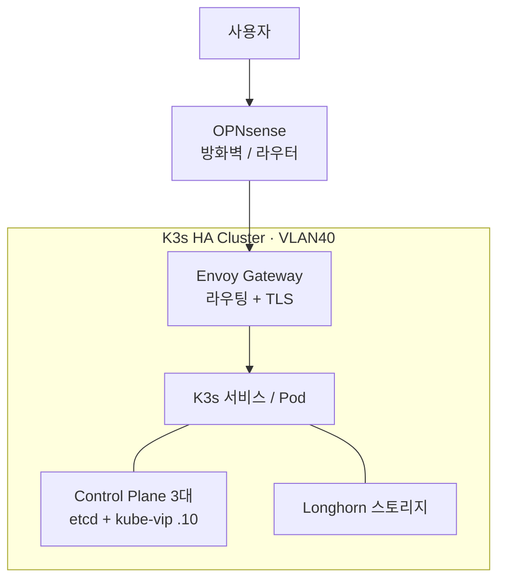

# Homelab Infrastructure

Proxmox 기반 홈랩 Kubernetes 클러스터를 Terraform으로 VM을 만들고 Ansible로 구성하며, ArgoCD로 운영하는 개인 인프라 프로젝트입니다.

> [!NOTE]
> 개인 학습·운영용 홈랩입니다. 구성 과정에서 공식 문서와 AI 도구의 도움을 활용했고, 생성된 설정은 직접 검증·수정해 적용했습니다. BGP 디버깅이나 GPU 패스스루 같은 일부 심화 영역은 아직 학습 중입니다.
> 이 저장소는 실제 운영 중인 홈랩에서 인프라 코어와 immich, vaultwarden 등 일부 서비스만 발췌해 공개한 것으로, 전체 구성의 일부입니다.

## 구성 개요

- **가상화**: Proxmox VE 2대(UM880, WTR-Pro)와 Radxa N100 베어메탈
- **클러스터**: K3s 고가용성 구성 — Server 3대로 etcd 합의, Worker 다수
- **네트워크**: VLAN으로 관리망과 서비스망을 분리
- **CNI**: Cilium이 Pod 네트워크를 담당하고, LoadBalancer IP를 OPNsense에 BGP로 광고
- **스토리지**: Longhorn 분산 블록 스토리지
- **인그레스**: Envoy Gateway로 Gateway API 기반 라우팅
- **GitOps**: ArgoCD로 Git 저장소와 클러스터 상태를 동기화
- **모니터링**: Prometheus, Grafana, Loki, Telegraf
- **백업**: PBS로 VM을, Longhorn으로 볼륨 데이터를 백업

## 아키텍처



외부 트래픽은 OPNsense를 거쳐 Envoy Gateway로 들어오고, Gateway가 도메인별로 알맞은 서비스로 라우팅합니다. 클라우드 로드밸런서가 없는 홈랩 환경이라, Cilium이 OPNsense에 BGP로 LoadBalancer IP 경로를 광고해 외부에서 접근할 수 있게 합니다.

## 네트워크

| VLAN | 서브넷 | 용도 |
|------|--------|------|
| VLAN1 LAN | 192.168.1.0/24 | 관리, 내부 서비스 |
| VLAN40 SVC | 192.168.4.0/24 | K3s 클러스터 전용 |

- 전 구간을 MTU 9000으로 통일했습니다. VLAN 간 통신에서 MTU가 달라 큰 패킷이 드롭되는 문제를 겪고 모두 9000으로 맞춰 해결했습니다.
- kube-vip 가상 IP `192.168.4.10` — API Server 고가용성 진입점
- Cilium LoadBalancer IP 풀 `192.168.4.80~90`

## 주요 구성 요소

| 컴포넌트 | 용도 |
|----------|------|
| K3s | 경량 Kubernetes 클러스터 |
| kube-vip | API Server 고가용성용 가상 IP |
| Cilium | Pod 네트워크와 LoadBalancer IP 할당, BGP 광고 |
| Longhorn | 분산 블록 스토리지 |
| Envoy Gateway | Gateway API 기반 인그레스 |
| cert-manager | Let's Encrypt TLS 인증서 자동 발급 |
| Sealed Secrets | 시크릿을 암호화해 Git에 커밋 |
| ArgoCD | GitOps 지속적 배포 |
| Prometheus / Grafana / Loki | 메트릭, 대시보드, 로그 |

## 트러블슈팅 기록

구축 과정에서 직접 겪고 해결한 주요 문제들입니다.

- **MTU 불일치**: 다른 VLAN의 노드가 클러스터 합류에 실패했습니다. ping은 되는데 K3s API 통신만 타임아웃이었고, 원인은 VLAN별 MTU가 1500과 9000으로 달라 큰 패킷이 드롭된 것이었습니다. 전 구간을 9000으로 통일해 해결했습니다.
- **kube-vip hostNetwork 누락**: kube-vip Pod가 Pod 네트워크에 갇혀 가상 IP가 호스트에 바인딩되지 않았습니다. DaemonSet에 `hostNetwork: true`를 추가해 해결했습니다.
- **Longhorn 기동 실패**: 노드에 `open-iscsi`가 없어 볼륨 연결에 실패했습니다. Longhorn이 iSCSI를 쓰기 때문인데, 모든 노드에 설치해 해결했습니다.

## 디렉터리 구조

```
terraform/   # Proxmox VM 프로비저닝
ansible/     # OS 설정, K3s 설치, 애드온 구성
k8s/         # ArgoCD가 관리하는 쿠버네티스 매니페스트
e25/         # 클러스터 외부 노드 (AdGuard, Uptime Kuma)
docs/        # 상세 문서
```

## 참고 문서

- [K3s HA 설치 가이드](docs/k3s-ha-setup.md)
- [네트워크 아키텍처](docs/network-architecture.md)
- [백업 및 재해복구 전략](docs/backup-strategy.md)
