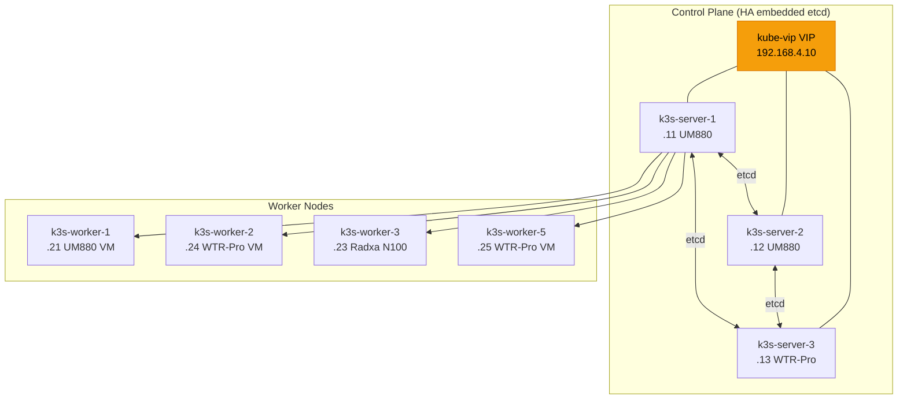
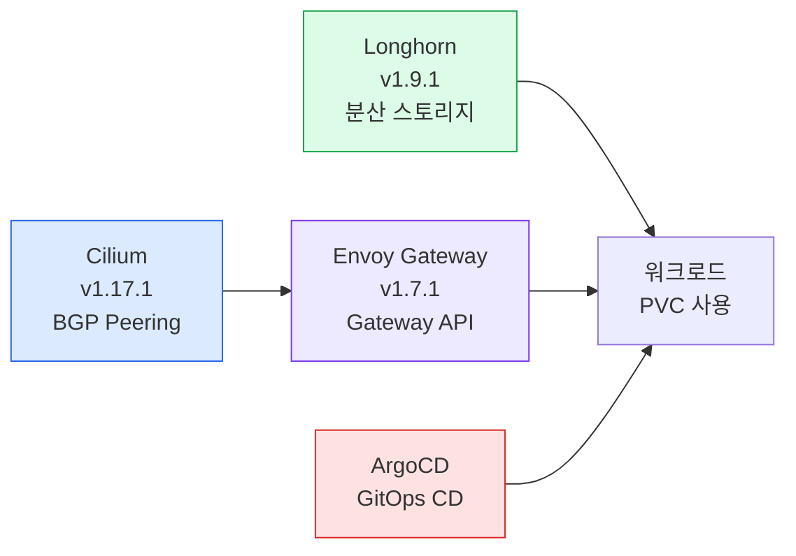

# k3s HA 클러스터 설치 가이드

k3s embedded etcd + kube-vip 기반 고가용성 클러스터 구축 가이드입니다.

## 개요

### 클러스터 구성



### Addon 스택



### 구성 요약

- **Server 노드 3대**: embedded etcd로 고가용성 control plane 구성
- **Worker 노드**: WTR-Pro/UM880 VM과 Radxa N100 베어메탈
- **kube-vip**: API Server 가상 IP 192.168.4.10 — DaemonSet으로 배포, hostNetwork 사용
- **Cilium**: Pod 네트워크와 LoadBalancer IP 할당 192.168.4.80-90, OPNsense와 BGP 피어링으로 경로 광고
- **Longhorn**: 분산 블록 스토리지, 기본 StorageClass로 설정
- **Envoy Gateway**: Gateway API 기반 인그레스
- **ArgoCD**: GitOps 지속적 배포

### 왜 embedded etcd인가?

외부 etcd 클러스터를 별도로 운영하면 관리 포인트가 늘어납니다. K3s embedded etcd는 server 노드 3대만으로 etcd HA가 자동 구성되어 홈랩 규모에 적합합니다. etcd 쿼럼을 유지하려면 반드시 **홀수 개**(3, 5, 7..)의 server 노드가 필요합니다.

### 왜 kube-vip인가?

kube-vip는 DaemonSet으로 배포되어 server 노드 중 하나에 VIP를 바인딩합니다. 리더 노드 장애 시 다른 server 노드로 VIP가 자동 페일오버됩니다. HAProxy + keepalived 대비 구성이 단순하고 K3s auto-deploy manifest로 관리할 수 있습니다.

> **주의**: kube-vip DaemonSet에 반드시 `hostNetwork: true`를 설정해야 합니다. 없으면 Pod 네트워크 안에서 동작하여 VIP가 호스트 인터페이스에 바인딩되지 않습니다.

### 왜 Envoy Gateway인가?

ingress-nginx가 2026년 3월 EOL에 들어갔습니다. Gateway API는 Kubernetes의 차세대 Ingress 표준이며, Envoy Gateway는 Gateway API와 설계 철학이 가장 잘 맞는 구현체입니다. 독립적인 아키텍처라 향후 Cilium 환경의 고도화에도 영향을 받지 않습니다.

## 사전 요구사항

### 인프라

1. **Proxmox 클러스터**: um880 + pve-wtrpro
2. **Cloud-Init 템플릿 VM**: um880에 VM9000, pve-wtrpro에 VM9001
3. **네트워크**: OPNsense에 SVC VLAN40 (192.168.4.0/24) 설정 완료
4. **OPNsense MTU**: LAN/SVC 인터페이스 MTU 9000
5. **브릿지**: 양쪽 Proxmox 노드에 `vnetsvc` 브릿지 존재

### 로컬 환경

```bash
# WSL2 (Ubuntu) 기준
sudo apt install ansible sshpass
pip install ansible --break-system-packages

# Terraform
# Windows: choco install terraform
```

### SSH 접근

```bash
# 각 노드에 SSH 키 기반 접속 (Cloud-Init으로 공개키 주입됨)
ssh jw@192.168.4.11
```

## 설치 절차

### Step 1: Terraform으로 VM 생성

```bash
cd terraform/k3s-cluster
cp terraform.tfvars.example terraform.tfvars
terraform init
terraform plan
terraform apply
```

### Step 2: SSH 연결 확인

```bash
# Terraform output의 노드 IP로 SSH 연결 확인
ssh jw@192.168.4.11 "hostname"
```

### Step 3: Ansible로 전체 설치

```bash
cd ansible
ansible-playbook -i inventory.yml site.yml --tags k3s
```

단계별 실행:

| 순서 | 태그 | 설명 |
|------|------|------|
| 1 | `k3s-common` | OS 공통 설정 |
| 2 | `k3s-server` | HA server 3대 (serial: 1) |
| 3 | `k3s-worker` | VM worker 조인 |
| 4 | `k3s-worker-baremetal` | Radxa N100 조인 |
| 5 | `cilium` | Cilium CNI 및 LB IPAM 설치 |
| 6 | `longhorn` | Longhorn 분산 스토리지 |
| 7 | `envoy-gateway` | Envoy Gateway (Gateway API) |
| 8 | `argocd` | ArgoCD GitOps |

### Step 4: kubeconfig 설정

```bash
scp jw@192.168.4.11:/etc/rancher/k3s/k3s.yaml ~/.kube/config
sed -i 's/127.0.0.1/192.168.4.10/' ~/.kube/config
kubectl get nodes -o wide
```

## 설치 후 확인

```bash
# 노드 상태 확인
kubectl get nodes -o wide

# kube-vip (hostNetwork IP 확인)
kubectl get pods -n kube-system -l app.kubernetes.io/name=kube-vip -o wide

# Cilium BGP 상태 확인
kubectl get ciliumbgpclusterconfig
kubectl get ciliumbgppeerconfig

# Longhorn
kubectl get storageclass
kubectl get pods -n longhorn-system | grep -c Running

# Envoy Gateway
kubectl get gateway,gatewayclass -A
kubectl get svc -n envoy-gateway-system

# ArgoCD
kubectl get svc argocd-server -n argocd
```

## Ansible Role 상세

### k3s_server

HA control plane + Longhorn 의존성:

- open-iscsi, nfs-common 설치 (Longhorn용)
- `/etc/rancher/k3s/config.yaml` (disable traefik/servicelb, tls-san)
- kube-vip RBAC + DaemonSet (hostNetwork: true)
- init 서버: `--cluster-init`, join 서버: VIP로 조인
- `serial: 1`로 순차 실행

### k3s_worker / k3s_worker_baremetal

- VIP(192.168.4.10:6443)로 agent 조인
- open-iscsi, nfs-common (Longhorn용)
- baremetal: qemu-guest-agent 제외

### envoy_gateway

- Envoy Gateway v1.7.1 설치
- GatewayClass `envoy-gateway` 생성
- Gateway `homelab-gateway` (HTTP:80 + HTTPS:443, 전체 네임스페이스 허용)
- Cilium IPAM이 할당한 LoadBalancer IP를 BGP로 OPNsense에 광고

## 트러블슈팅 기록

### kube-vip hostNetwork 누락

**증상**: kube-vip Pod Running이지만 VIP가 eth0에 바인딩 안 됨. Pod IP가 10.42.x.x(Pod 네트워크)로 표시됨.

**원인**: DaemonSet에 `hostNetwork: true` 누락.

**해결**: 매니페스트에 `hostNetwork: true` 추가 후 Pod 재시작.

### MTU 크로스 VLAN 문제

**증상**: LAN VLAN의 노드에서 K3s agent 조인 시 `context deadline exceeded`. ping은 되지만 대용량 패킷 교환 실패.

**원인**: OPNsense VLAN 서브인터페이스 MTU가 기본 1500.

**해결**: OPNsense Interfaces → [LAN]/[SVC] MTU를 9000으로 설정.

### Longhorn server 노드 CrashLoopBackOff

**증상**: longhorn-manager가 server 노드에서 CrashLoopBackOff. `iscsiadm: No such file or directory`.

**원인**: k3s_server role에 open-iscsi 미설치.

**해결**: server 노드에 `apt install open-iscsi` + iscsid 활성화. k3s_server role에 Longhorn 의존성 추가.

## 참고

- [Techno Tim k3s-ansible](https://github.com/techno-tim/k3s-ansible)
- [K3s HA with embedded etcd](https://docs.k3s.io/datastore/ha-embedded)
- [kube-vip DaemonSet 설치](https://kube-vip.io/docs/installation/daemonset/)
- [Cilium BGP Control Plane](https://docs.cilium.io/en/stable/network/bgp-control-plane/bgp-control-plane-v2/)
- [Longhorn 설치](https://longhorn.io/docs/1.9.1/deploy/install/install-with-kubectl/)
- [Envoy Gateway 설치](https://gateway.envoyproxy.io/docs/install/install-yaml/)
