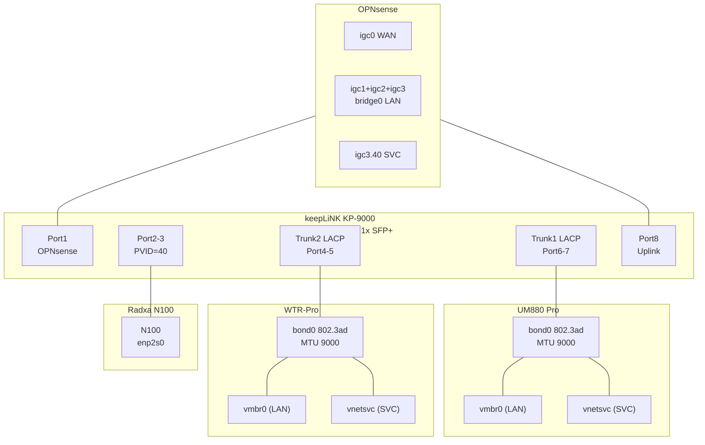
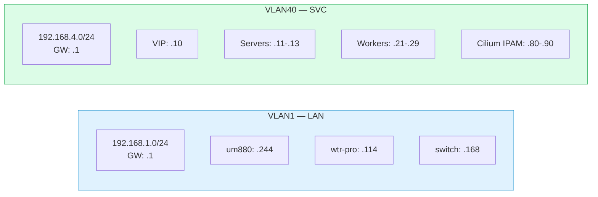
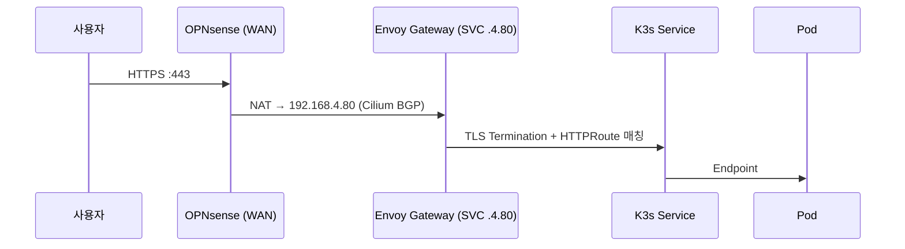

# 네트워크 아키텍처

홈랩 네트워크의 VLAN 구성, 방화벽 정책, 물리 토폴로지를 정리합니다.

## 물리 토폴로지

## VLAN 설계

> **VLAN30 (PUB, 192.168.3.0/24)**: 현재 비활성. OPNsense `igc3.30` 인터페이스와 스위치 Tagged VLAN 설정은 유지됨. 향후 DMZ 용도로 재활용 가능.

| VLAN ID | 이름 | 서브넷 | Gateway | 용도 | 상태 |
|---------|------|--------|---------|------|------|
| 1 | LAN | 192.168.1.0/24 | 192.168.1.1 | 관리, 내부 서비스, Pi-hole, Home Assistant | 활성 |
| 30 | PUB | 192.168.3.0/24 | 192.168.3.1 | DMZ 예비 | 비활성 |
| 40 | SVC | 192.168.4.0/24 | 192.168.4.1 | K3s 클러스터 전용 | 활성 |

## 스위치 포트 설정 (keepLiNK)

| 포트 | 연결 대상 | Untagged | Tagged |
|------|-----------|----------|--------|
| Port 1 | OPNsense | VLAN1 | — |
| Port 2 | Radxa N100 | VLAN40 (PVID) | — |
| Port 4-5 | WTR-Pro (Trunk2, LACP) | VLAN1 | VLAN30, VLAN40 |
| Port 6-7 | UM880 (Trunk1, LACP) | VLAN1 | VLAN30, VLAN40 |
| Port 8 | Uplink / OPNsense | VLAN1 | VLAN30, VLAN40 |

> VLAN30 Tagged 설정은 스위치에 잔존하지만, 해당 VLAN에 활성 호스트가 없으므로 트래픽 없음. 추후 정리 시 VLAN30 Tagged 제거 가능.

추가 설정: QoS Queue8 (Port 8, Trunk1, Trunk2), RSTP + IGMP Snooping, Jumbo Frame 12000, SFP+ 미사용

## MTU 설정 (중요)

전체 경로에서 Jumbo Frame(MTU 9000)을 일관되게 설정해야 합니다.

| 구간 | MTU | 설정 위치 |
|------|-----|-----------|
| keepLiNK Switch | 9000 | Switch 관리 UI → Jumbo Frame |
| Proxmox bond0 / vmbr0 / vnetsvc | 9000 | `/etc/network/interfaces` |
| OPNsense LAN / SVC 인터페이스 | 9000 | Interfaces → [LAN]/[SVC] → MTU |
| VM eth0 (Cloud-Init) | 9000 | Terraform `network_device.mtu` |

> **주의**: OPNsense VLAN 서브인터페이스의 MTU가 기본값(1500)이면 크로스 VLAN 라우팅 시 K3s agent 조인 등 큰 패킷 교환이 실패합니다. 증상: ping은 되지만 K3s API 통신에서 `context deadline exceeded` 타임아웃 발생.

## 외부 트래픽 흐름

## IP 할당 계획

### SVC VLAN40 (192.168.4.0/24)

| IP 범위 | 용도 |
|---------|------|
| 192.168.4.1 | Gateway (OPNsense) |
| 192.168.4.10 | kube-vip VIP (API Server) |
| 192.168.4.11-13 | K3s Server 노드 |
| 192.168.4.21-29 | K3s Worker 노드 |
| 192.168.4.80-90 | Cilium LB IPAM Pool |
| 192.168.4.100+ | 기타 서비스 (예약) |

### LAN VLAN1 (192.168.1.0/24)

| IP | 호스트 |
|----|--------|
| 192.168.1.1 | OPNsense (GW) |
| 192.168.1.114 | pve-wtrpro |
| 192.168.1.168 | keepLiNK Switch (mgmt) |
| 192.168.1.244 | um880 |

## 방화벽 정책 (OPNsense)

Proxmox 클러스터/SDN 방화벽은 비활성화. OPNsense가 모든 정책을 관리합니다.

### 도메인 매핑

| 도메인 | 대상 | 경로 |
|--------|------|------|
| vaultwarden.fresh96jwjw.org | Vaultwarden (K3s) | WAN NAT → .4.80 |
| *.local.fresh96jwjw.org | K3s 내부 서비스 | LAN → .4.80 |
| hass.fresh96jwjw.org | Home Assistant | LAN 직접 |

### 주요 방화벽 규칙

- **WAN → SVC**: NAT 포트포워딩 (443 → 192.168.4.80)
- **LAN → SVC**: 허용 (관리 접근, kubectl)
- **SVC → LAN**: 제한적 허용 (DNS, NFS, Gitea)
- **SVC → WAN**: 허용 (컨테이너 이미지 pull, apt 업데이트)
- **PUB 관련**: 비활성
- **Inter-VLAN**: 기본 차단, 명시적 허용만 통과

## 성능 벤치마크

iperf3 결과 (LAG, bond0):
- **Single-stream**: 2.48 Gbps
- **4-stream**: 3.51 Gbps

## 관련 문서

- [K3s HA 설치 가이드](k3s-ha-setup.md)
